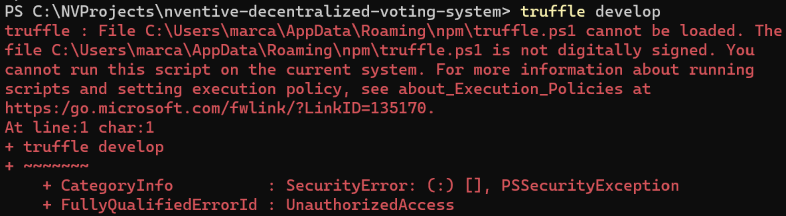
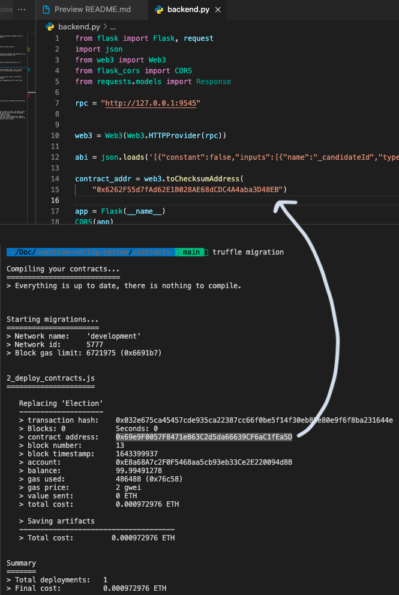
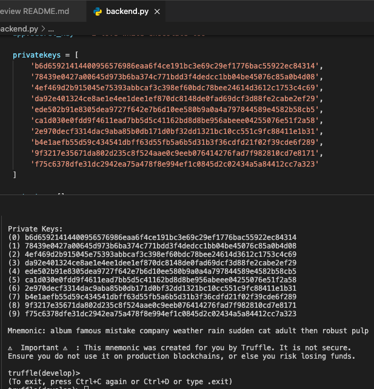
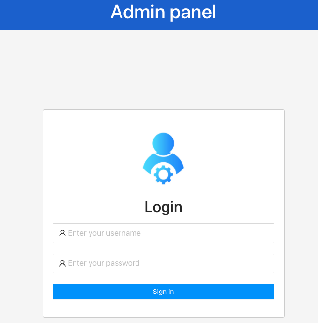

# Voting System using Smart contract

> This is a decentralized voting system based on Blockchain technology, which is distributed over a network using smart contracts.

## Setup

### _Additionnal step on Windows_:

If you get the following error while running any script:


You'll need to run `Set-ExecutionPolicy -Scope Process -ExecutionPolicy Bypass`.

### Building the smart contract

1. First, you'll need truffle to interact with the smart contract :

```
npm i -g truffle
```

2. Truffle gives you a development environment with 10 accounts with Ethereum so you can interact with the contract, under the `/contracts` directory, run:

```
truffle develop
```

3. Also, to compile the smart contract, under the `/contracts` directory, run:

```
truffle migration
```

4. Update the `backend.py` file with the contract address that `truffle migrate` generates you. Also, update the private key list to the private keys given by `truffle develop` environment.

Here's some screenshots to help you with this step:

|            truffle migration            |            Verify private keys            |
| :-------------------------------------: | :---------------------------------------: |
|  |  |

### Backend

For the backend, you'll need Python and pip. If you don't have it, follow the instructions on https://www.python.org/downloads/.

1. Let's create a virtual env for our project's dependencies on the root of the project:

```
pip install virtualenv
virtualenv venv
source venv/bin/activate -> .\Scripts\activate on Windows
pip install -r requirements.txt
```

2. You can now run the backend by running:

```
python backend.py
```

### Frontend

The frontend is a React app. To run it, first go to the `/frontend` directory and run:

```
yarn install
yarn start
```

You should see the login screen :


You can also access the voting results by accessing the http://localhost:3000/admin link. Username is `test` and password is `test123`:



## Possible improvements

- Add Metamask integration in the login page, currently to login, you simply enter a number from 0 to 9 that links to the proper account from the truffle environment.
- Improve overall security of the React app/smart contract
- Clean the frontend code, many components could be reused.
- Add methods to the smart contract other than vote (vote delegation for example).
- Integrate this smart contract in the Ropsten test network. You'll also need to use the Ropsten Ethereum Faucet to add test Ethereum to your accounts.
